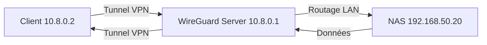
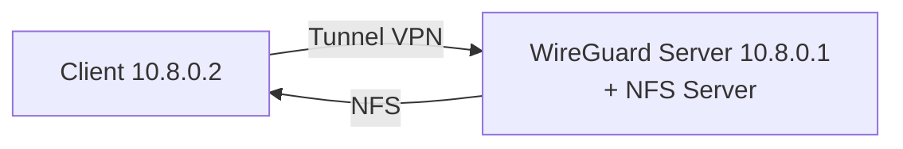

 [](https://hub.docker.com/r/dbndev/nfs-wireguard-bridge)

# 🚦 NFS WireGuard Bridge

**Serveur NFS sécurisé derrière WireGuard pour exposer vos dossiers locaux à distance, sans compromis sur la sécurité ni la performance.**  
Partagez vos environnements de développement, projets, volumes Docker ou données sensibles entre plusieurs machines, même à travers Internet ou NAT.

---

## Sommaire / Table of Contents

- [🚀 Features / Fonctionnalités](#-features--fonctionnalités)  
- [⚡️ Quick Start / Démarrage rapide](#️-quick-start--démarrage-rapide)  
- [🛠️ Use Cases / Cas d’usage](#️-use-cases--cas-dusage)  
- [🔧 Personnalisation / Customization](#-personnalisation--customization)  
- [📝 Dépendances / Dependencies](#-dépendances--dependencies)  
- [🏆 Avantages WireGuard / WireGuard Benefits](#-avantages-wireguard--wireguard-benefits)  
- [❤️ Merci / Contribution / Thanks](#-merci--contribution--thanks)  
- [🇬🇧 English Summary](#-english-summary)  
- [🔗 Licence / License](#-licence--license)  

---

## 🚀 Features / Fonctionnalités

- **NFSv3** exposé derrière **WireGuard** VPN (pas besoin d’ouvrir vos ports sur Internet)  
- Montage NFS natif performant (lecture/écriture)  
- Accès distant **sécurisé** (chiffrement WireGuard, port UDP configurable)  
- Prêt pour macOS, Linux, devcontainers, Docker, etc.  
- Utilisable en mode "bridge", "bastion", ou microservice dans un Compose/Swarm/K8s  
- 🔒 Tous les ports RPC NFS sont fixés (pour VPN/NAT/Cloud)  

### Example d'utilisation : accès à un NAS distant



---

### 📡 Schéma de fonctionnement / Architecture diagram

```
┌──────────────┐         WireGuard (VPN)         ┌──────────────┐
│  Laptop Mac  │  <───────────────────────────>  │  NFS Server  │
│ (Client WG)  │        UDP/51820 + NFS          │ (Docker Host)│
└──────────────┘                                 └──────────────┘
```

---

## 🧭 Deux modes d’utilisation : NFS embarqué vs Bridge NFS vers NAS

Ce projet propose deux modes d’utilisation principaux pour exposer vos dossiers via NFS sécurisé par WireGuard :

### Mode 1 : NFS embarqué

Dans ce mode, le serveur NFS tourne directement dans le container WireGuard, exposant les dossiers locaux du host.

- **Avantages**  
  - Simplicité de déploiement : tout est dans un seul container  
  - Idéal pour partager des dossiers locaux du host  
  - Configuration centralisée dans le container WireGuard  

- **Limites**  
  - Les performances peuvent être limitées selon la charge du container  
  - Moins adapté si vous avez déjà un NAS ou un serveur NFS dédié  



### Mode 2 : Bridge NFS vers NAS

Ici, le container WireGuard agit comme un pont VPN vers un NAS ou serveur NFS existant sur le LAN.

- **Avantages**  
  - Permet d’accéder à un NAS distant sans exposer ses ports sur Internet  
  - Performance native du NAS, pas de surcharge dans le container WireGuard  
  - Flexibilité pour intégrer des infrastructures existantes  

- **Limites**  
  - Nécessite un NAS ou serveur NFS déjà en place sur le réseau local  
  - Configuration réseau et routage un peu plus complexe  


---

## ⚡️ Quick Start / Démarrage rapide

### 1. Build & Run

```bash
git clone https://github.com/dbndev/nfs-wireguard-bridge.git
cd nfs-wireguard-bridge
make build
make server-up
```

- Les dossiers `/workspaces` et `/runner` du host seront exposés via NFS derrière le VPN WireGuard.  
- Le fichier de configuration WireGuard client est généré automatiquement dans `./state/macbook.conf`.  

---

### 2. Configurer votre client WireGuard (Macbook, PC, autre serveur)

- Récupérez le fichier généré :

```bash
docker cp nfs-wireguard-bridge:/state/macbook.conf ./macbook.conf
```

- Importez ce fichier dans WireGuard sur votre machine cliente.

---

### 3. Monter le dossier NFS

Sur Mac/Linux, exécutez :

```bash
sudo mount -t nfs -o vers=3,rw,resvport 10.8.0.1:/workspaces /tmp/testnfs
```

- Pour monter `/runner` : remplacez `/workspaces` par `/runner`.  
- Astuce macOS : le port 2049 doit être accessible, l’option `nolock` n’est pas requise ici (lockd/statd supportés).

---

### 4. Exemple de configuration dans `docker-compose.yml`

```yaml
volumes:
  video:
    driver: local
    driver_opts:
      type: "nfs"
      o: "addr=10.8.0.1,rw,vers=3,rsize=8192,wsize=8192,tcp,timeo=14"
      device: ":/workspaces"
```

---

## 🛠️ Use Cases / Cas d’usage

- Partager un workspace de développement local sur une machine distante (Macbook, PC, VM, cloud…)  
- Centraliser les données d’une stack Docker multi-hôte via NFS sécurisé  
- Synchroniser projets, scripts, ou médias entre vos machines sans dépendre de services tiers  
- Remplacer SSHFS ou SMB dans des contextes VPN, NAT, ou réseaux restreints  

### Quand choisir quel mode ?

- **NFS embarqué** : si vous voulez partager directement vos dossiers locaux et préférez une solution simple tout-en-un.  
- **Bridge NFS vers NAS** : si vous disposez déjà d’un NAS ou serveur NFS sur votre réseau local et souhaitez y accéder en toute sécurité via VPN.

---

## 🔧 Personnalisation / Customization

- Les variables d’environnement `NFS_WIREGUARD_SERVER_HOST` et `NFS_WIREGUARD_SERVER_PORT` sont disponibles dans le `docker-compose.yml`.  
- Pour exposer d’autres dossiers : modifiez la section `volumes:` dans `docker-compose.yml` et ajoutez le chemin dans `/etc/exports` via `entrypoint.sh`.  

---

## 📝 Dépendances / Dependencies

- Docker Engine (recommandé : version 20+)  
- Pour le client : WireGuard, utilitaire NFS (`nfs-common` sur Linux, `nfs-client` sur macOS)  

---

## 🏆 Avantages WireGuard / WireGuard Benefits

- Démarrage instantané, performances optimales, gestion simplifiée des clés et des routes  
- Pas de “race condition” avec l’ouverture des ports (tout est tunnelé)  

---

## ❤️ Merci / Contribution / Thanks

N’hésitez pas à ouvrir une issue, proposer une PR ou forker !  
Ce projet est utilisé dans l’écosystème Vegito, mais reste agnostique et open source.

---

## 🇬🇧 English Summary

This image allows you to expose local folders (or Docker volumes) over a fast, secure NFSv3 tunnel protected by WireGuard.  
Use cases: dev workspaces, Docker clusters, file servers, or remote development.

1. Build and run the container  
2. Retrieve the client config (`./state/macbook.conf`)  
3. Import into WireGuard and mount with native NFS!  

---

## 📣 Author

David Berichon ([dbndev](https://github.com/dbndev))

---

## 📦 Docker Hub (coming soon)

Contact me if you want a ready-to-use public image!

---

## 🔗 Licence / License

MIT
