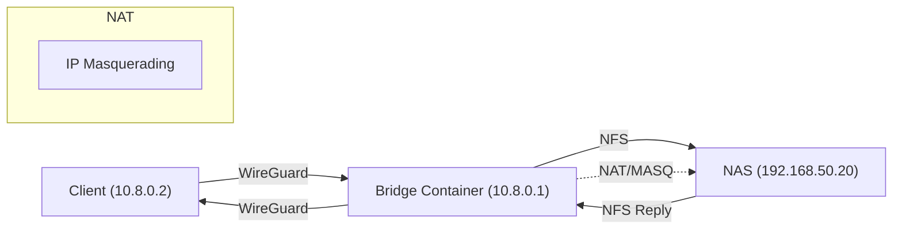

 [](https://hub.docker.com/r/dbndev/nfs-wireguard-bridge)

# NFS WireGuard Bridge


**Secure, high-performance NFS sharing via WireGuard VPN**

This project provides a simple and robust solution for securely exposing local development volumes (or any directory) over NFS, tunneled through a WireGuard VPN. Designed for remote development, hybrid local/cloud workflows, and situations where you want to access private files on a remote LAN (e.g. home, office, datacenter) as if they were local.

---

## Features

- **NFS v3 or v4 server** running inside a dedicated container
- **WireGuard VPN** endpoint (server or client mode)
- Securely bridge any local path, NAS share, or Docker volume over VPN
- 🔑 Only trusted peers (with private key) can access NFS export
- 🚀 High-speed, low-latency transfers (native NFS protocol, direct kernel path)
- **No ports exposed** to WAN/Internet
- 🛡️ Docker Compose/Swarm compatible
- Lightweight, stateless, cloud/devbox/lab-ready

---

## Use Cases

- Access your home/office dev folders from anywhere (laptop, cloud VM, etc)
- Bridge a Synology/TrueNAS or any NAS/NFS appliance behind restrictive firewalls
- Replace SMB or slow SSHFS mounts with real, native NFS
- Connect VSCode devcontainers to your remote workstation or NAS
- Use as a building block for advanced self-hosted CI/CD runners
- Temporary secure access to a build or cache folder for remote jobs

---

## Quickstart

### 1. Run the NFS+WireGuard bridge container on the server side

```yaml
# docker-compose.yml
services:
  server:
    image: dbndev/nfs-wireguard-bridge:latest
    container_name: nfs-wireguard-bridge
    cap_add:
      - NET_ADMIN
    privileged: true
    network_mode: bridge
    ports:
      - "51820:51820/udp"
    volumes:
      - /workspaces:/exports/workspaces:rw
      - /runner:/exports/runner:rw
      # Optionally, bridge a NAS/NFS mount from the host
      - video-nas:/exports/video:rw
    environment:
      - WG_CLIENT_PUBKEY=your_client_pubkey
      - WG_CLIENT_IP=10.8.0.2
      - WG_SERVER_PORT=51820
      # ...more options

volumes:
  video-nas:
    driver: local
    driver_opts:
      type: "nfs"
      o: "addr=nas.local,rw,nfsvers=4"
      device: ":/volume1/video"
```

### 2. Configure your WireGuard client (macOS/Linux/Win/Android)

Obtain the config from `state/client.conf` or generate your own. Example:

```ini
[Interface]
PrivateKey = ...
Address = 10.8.0.2/24
DNS = 1.1.1.1

[Peer]
PublicKey = ...
Endpoint = my-home.example.com:51820
AllowedIPs = 0.0.0.0/0
PersistentKeepalive = 25
```

### 3. Mount NFS from the remote client

```sh
# macOS (example, adjust path as needed)
sudo mount -t nfs -o vers=3,rw,resvport 10.8.0.1:/exports/workspaces /private/tmp/testnfs

# Linux
docker run --rm --cap-add SYS_ADMIN --device /dev/fuse nfs-utils mount -t nfs ...
```

---

## Architecture

### Classic NFS Bridging (with remote NAS)



### Embedded NFS Mode (exporting local volumes directly)


---

## Mode Comparison

| Mode                  | Pros                                                       | Cons                                                     |
|-----------------------|------------------------------------------------------------|----------------------------------------------------------|
| **NFS bridge (NAS)**  | - Directly shares remote NAS                              | - Added routing/iptables complexity                      |
|                       | - No NFS server in container needed (just relay)           | - Adds NAT layer, can impact performance                 |
|                       | - Works with legacy/existing NAS configs                  | - NFS export must allow relay server’s LAN IP            |
| **Embedded NFS**      | - Direct NFS from host paths/volumes (no relay)           | - Shares only container’s accessible folders             |
|                       | - No extra NAT, simple routing                           | - Cannot re-export upstream NFS in all cases (root_squash/NAS options may block) |
|                       | - Fastest for code/CI dev                                 | - Requires host volume mounts                            |

#### When to use each mode?
- Use **Embedded NFS** when you want to share your devbox/server’s real files or Docker bind-mounts directly (full control, best perf, ideal for CI/dev).
- Use **Bridge/NAS** mode when your data is on a NAS or an NFS server you *cannot* touch, or want to provide access to NAS data over VPN.

---

## DockerHub Integration

Build & push automated:

```sh
# Manual push
DOCKER_BUILDKIT=1 docker buildx build --platform linux/amd64,linux/arm64 \
  -t dbndev/nfs-wireguard-bridge:latest --push .
```

- See https://hub.docker.com/r/dbndev/nfs-wireguard-bridge
- Add badge: 
- For CI/CD: add GitHub Actions workflows for multiarch builds and auto-push

---

## Security and Best Practices

- Only allow trusted WireGuard keys/IPs in exports
- Avoid exposing NFS or WireGuard ports on WAN (use firewall, port knock, or reverse proxy for endpoint if needed)
- NFS over WireGuard is secure but NFS itself is not encrypted: **trust your peers**
- Use all_squash/anonuid for read-only shares or multi-user
- Always keep private keys secret; never commit them

---

## Troubleshooting

- If `mount_nfs: ... failed with 2` (No such file or directory): check that the export path exists **in the container**
- If `Permission denied`: check `/etc/exports` IP/CIDR matches the client’s VPN address
- To fix lock errors with NFSv3: run `rpc.statd --no-notify --port 32765 --outgoing-port 32766` and ensure ports are open
- On macOS, always use `resvport` for NFS v3
- See `docker logs nfs-wireguard-bridge` for container-side debug

---

## Credits

- David Berichon (@dbndev)
- ChatGPT & Oboe agent
- Based on Open Source: Debian Linux, WireGuard, nfs-utils

---

## License

MIT
